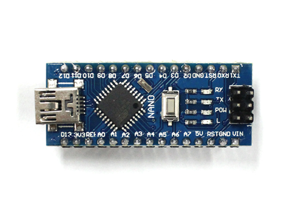
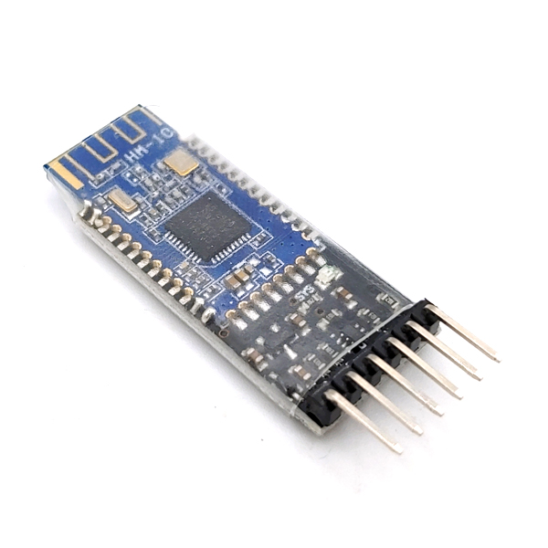
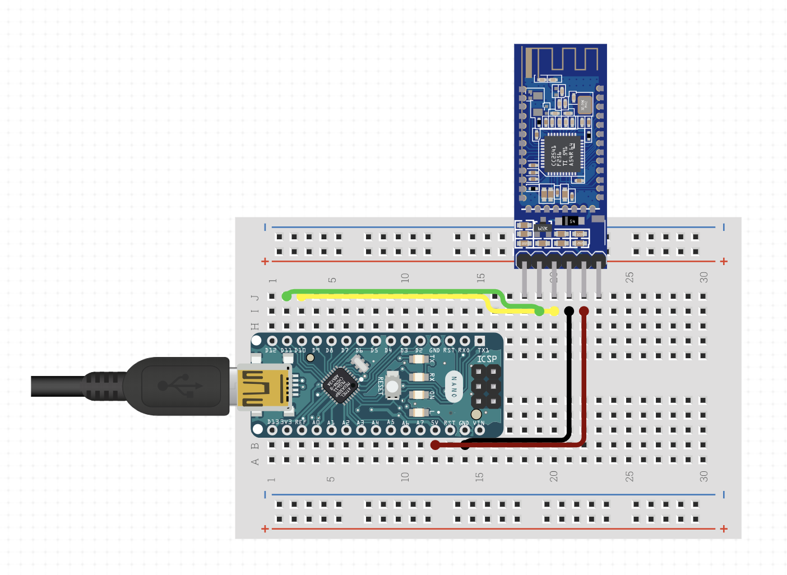

# Inunit
Simple BLE Beacon IoT device boilerplate with Arduino

## Parts
1. [Arduino Nano 호환 보드](http://www.devicemart.co.kr/goods/view?no=1342039)

2. [HM-10 블루투스 4.0 BLE 모듈](http://www.devicemart.co.kr/goods/view?no=1384572)

## Design

> With [circuito.io](https://circuito.io)

## Config
[config.ino](./config.ino) 업로드 후 시리얼로 설정

| COMMAND      | DESC           |
| ------------ | --------------:|
| AT           | 테스트(`OK` 반환) |
| AT+RENEW     | 공장 초기화       |
| AT+RESET     | 디바이스 재시작    |
| AT+MARJ`0x1234` | Major value 설정 |
| AT+MINO`0xFA01` | Minor value 설정 |
| AT+ADVI`5`   | Advertising Interval 설정 |
| AT+NAME`inu_0001` | 디바이스 이름 설정 |
| AT+IBEA1     | iBeacon 활성화 |
| AT+DELO2     | broadcasting만 허용 |

순서대로 설정 후 다시 재시작(`AT+RESET`)
